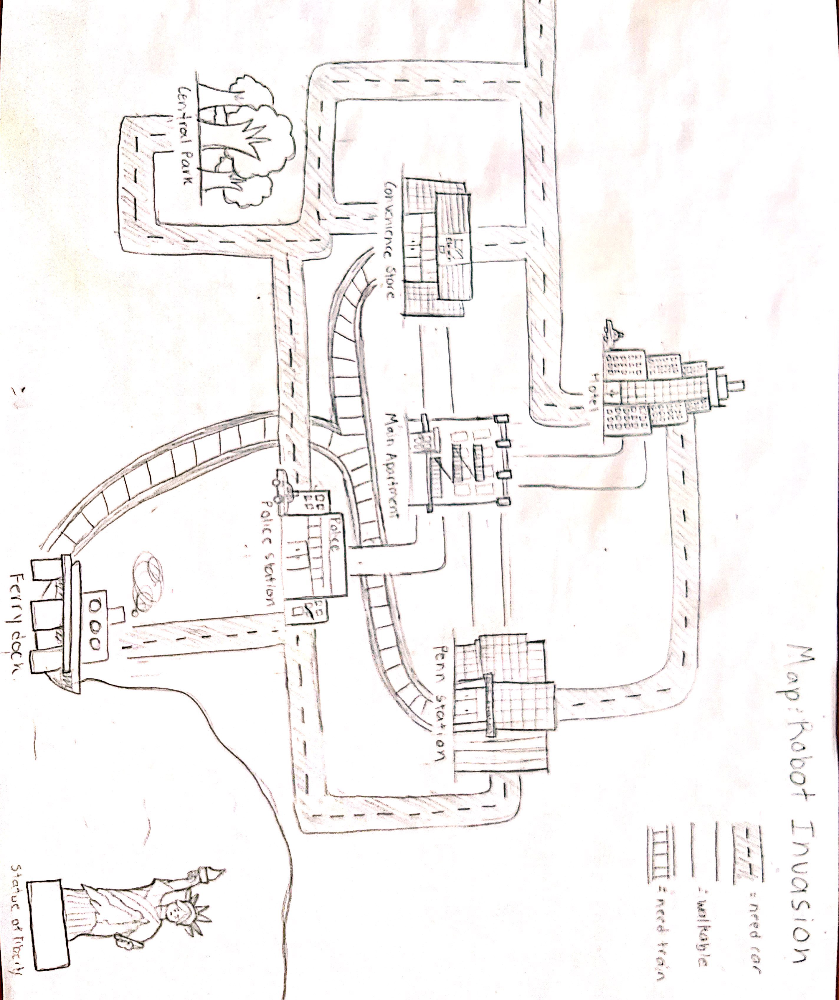

This file will contain documentation for all commands available in your game.

Submission includes a **cheat sheet** (`cheatsheet.md`) documenting all of the available commands, as well as a **description of the layout** of your game world's underlying physical layout; this can be described in words, or included as a separate image file if you prefer to sketch a map by hand.  If your game includes **challenges** that must be overcome to win, also describe them here. 

**The commands that are available to user are:**

    look around: gives the user a list of items and NPCs that are available in that space that could be brought along or taken.

    examine [item]: Examine's the item that the user has in their inventory and provide the descripton of that item.

    take [item]: allows the user to take an item from the location and store it in their inventory
    
    drop [item]: allows the user to drop an item that is in their inventory at the current location
    
    go to [place]: allows the user to move to different locations. Some locations are restricted and need certain items to gain access.
    
    attack [person] with [item]: allows the user to attack and NPC with a specificed item. NOTE: The user can also attack NPCs that are not robots but by doing so they lose that NPC's trust thus the NPC does not reveal any information that they have regarding the Robot Invasion. Every item except the Gun has a limited amount of hits before it breaks and since the gun has a bag of bullets with it, it can be used infinitely.
    
    bring [person]: allows the user to bring NPCs along with them. 
    
    eat [food]: allows the user to eat an edible item and gain or reduce health depending on if the food was good or bad and if the user gets food poisoning or not.
    
    approach [person]: allows the user to find out what the NPC knows about the Robot Invasion but if the NPC was attacked by the user before being approached them they will not reveal anything.
    
    check inventory: allows the user to check their inventory and see what items they are carrying
    
    check health: returns a number that indicates the health of the user 
    
    check party: provides a list of the people are with the user
    
    end game: allows the user to exit the game even if the game is unfinished
    
    help: provides the user with a list of commands that they can use

**Description of the layout:**

The map of the game is attached below and the main apartment has direct access to the penn station, convenience store, police station and hotel. The user cannot has to cross the main apartment each time they would like to move locations. However the police station and hotel have a car and van which would allow the user to drive anywhere they want except to the statue of liberty. The penn station also has a train which has a restricted access meaning the user will need a train switch and the homeless man for the train to work and the train can only take the user to the ferry or convenience store from the penn station. Lastly the statue of liberty has restricted access too, you can only go there if you have the homeless man and the boat keys. 

**Design Justification:**

We created our own graph implementation because we wanted custom classes that interacted with each other in a personalized manner. We did not implement guava because we had some personalized restrictions and neighbors. When the user has access to the any car whether that be the police car or the van at the hotel, the user is able to go anywhere except the statue of liberty, the location does not need to be the current locations neighbor. If the user does not have access to any of the cars, the user can simply walk to the locations that are neighboring to the current location, or the user can use the train with the train switch and homeless in their inventory. I beleive that if we used guava it would have been extremely difficult and unnecessarily confusing to debug and contruct this custom relationship between location.

Additionally, we used hashset to store the Items and NPCs in the user class and the location class to store the items that are available to be picked up(location class) and the items that are in the user's inventory(user class). We chose to use hashSets instead of arraylist because we wanted the game to be extensible and if there are a lot of items in a given location or in the user's inventory, the lookup for those items/NPCs is quick as well as the remove is quick. Additionally the hashSet does not allow duplicates which prevents our code form accidentally having errors/bugs.

One thing we would like to change is, we would have liked to store all of the methods of Robot Invasion class in a hashmap. If we were to set up the game again, we would have found a way to store all the methods in a hashMap and use the user's input to look for each method and perform it accordingly, this would compress our code and get rid of all the if/else statements. 

**Challenges:**

The user can move around each location and take food/weapons and approach NPCs to get more information about the Robot Invasion. The user can also bring NPCs to help them operate some of the transporatation vehicles like the boat and train. The user can eat and increase their health. The user has to beware of the robots at each location and keep their commands minimum otherwise they will attract robots that can attack them. The users also have to beware of the food that they eat because some of the food can turn out to be bad and cause food poisoning which would reduce their power. The NPCs that are not robot can also contribute to a deducation in the user's health if they are attacked because they will attack back for self-defense. 

The main goal of the game is to figure out how the Robot Invasion started and find the chip and attack the head robot with it at the statue of liberty. 

# SPOILER ALERT

**If your game includes challenges that must be overcome to win, also list them below.**

You can win the game even if you do not have the chip. You can simply kill the head robot with the gun and as long you have 36 or more life points.
